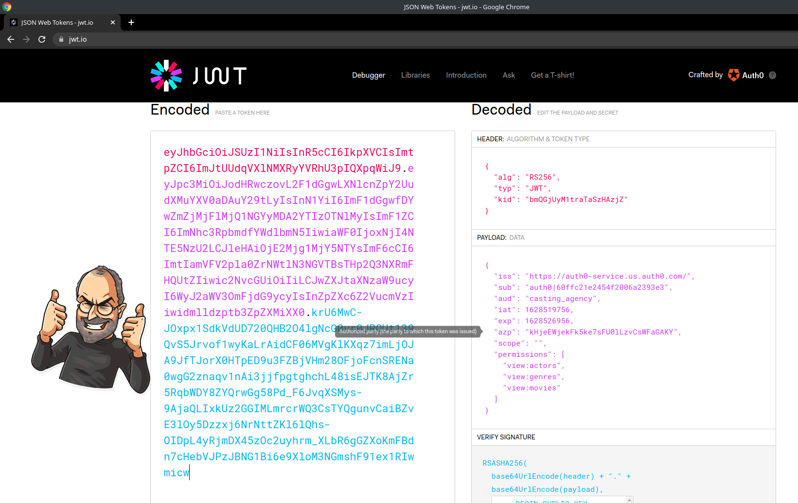
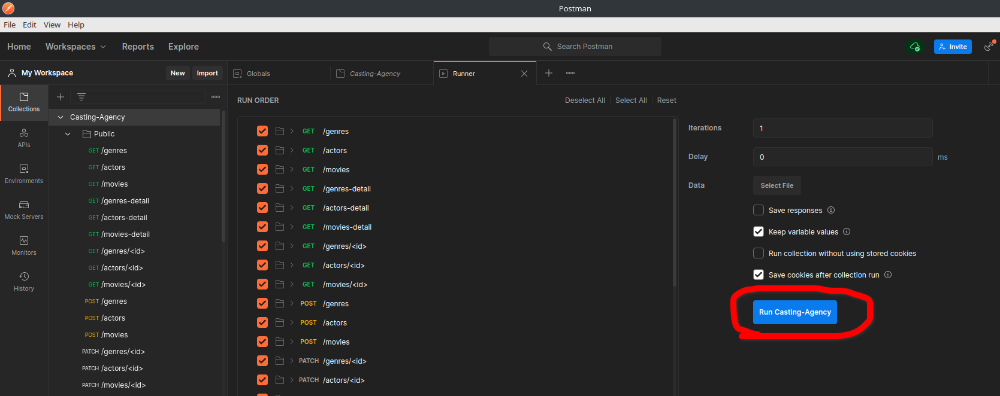

# Casting Agency 🔥
The Casting Agency models a company that is responsible for creating movies and managing and assigning actors to those movies. You are an Executive Producer within the company and are creating a system to simplify and streamline your process.
This is a Restful API written in Flask micro-framework.

# Introduction


## Tech Stack
------------------------------------------------------------------------------
|    Language    | Framework |  Database  | Tools for testting | Auth System |
|----------------|-----------|------------|--------------------|-------------|
| Python(v3.x.x) |   Flask   | Postgresql |  Unittest&Postman  |    Auth0    |


# SetUp database
* Create database called `casting_agency` or something which you like.
* Create database for API testing and change database_path on ` test_app.py ` file


# Run application(run)
* ⚠ Firstly you should setup database
* Windows using Git Bash:
    ```bash
        cd backend
        python -m venv env
        source env/scripts/activate
        source setup.sh
        pip install -r requirements.txt
        export DATABASE_URL="postgresql://<username>:<password>@localhost:5432/<your_db_name>"
        export TEST_DATABASE_URL="postgresql://<username>:<password>@localhost:5432/<your_db_name_for_testing>"
        export ASSISTANT_TOKEN="<assitant_token>"
        export DIRECTOR_TOKEN="<director_token>"
        export PRODUCER_TOKEN="<producer_token>"
        python manage.py runserver
    ```
* MacOS/Linux:
    ```bash
        cd backend
        python3 -m venv env
        source env/bin/activate
        source setup.sh
        pip3 install -r requirements.txt
        export DATABASE_URL="postgresql://<username>:<password>@localhost:5432/<your_db_name>"
        export TEST_DATABASE_URL="postgresql://<username>:<password>@localhost:5432/<your_db_name_for_testing>"
        export ASSISTANT_TOKEN="<assitant_token>"
        export DIRECTOR_TOKEN="<director_token>"
        export PRODUCER_TOKEN="<producer_token>"
        python3 manage.py runserver
    ```
> 
> 
* To setup models and fill database run following command:
    ```bash
        python3 manage.py setup_db
    ```
> 


# Authentication
### This API requires auth, and uses auth0 authentication system
### **Auth type🔐**: JWT
### This API supports RBAC 🔐

**There are 3 roles for management**:
  ```code
    - Assistant🔎
    - Director🔎♻
    - Executive Producer🔎♻🎥
  ```

**Permissions**:
  ```code
    - Assitant:
        - `view:genres`
        - `view:actors`
        - `view:movies`
    - Director:
        - All permissions of assistant
        -  `add:actors`
        -  `delete:actors`
        -  `patch:actors`
        -  `patch:actors`
        -  `patch:actors`
    - Executive Producer:
        - All permissions of director
        - `add:genres`
        - `add:movies`
        - `delete:genres`
        - `delete:movies`
  ```

**To testing API, I`ve prepared three accounts**:
  ```code
    - Assistant account:
        - **email📫**: caAssistant@gmail.com
    - Director account:
        - **email📫**: caDirector@gmail.com
    - Executive Producer:
        - **email📫**: caProducer@gmail.com
    - Password🔑:
        - **casting_agency123**
  ```
## Login🔐 to accounts*:
### To `login/signup` you should go to the page: https://auth0-service.us.auth0.com/authorize?response_type=token&audience=casting_agency&client_id=kHjeEWjekFk5ke7sFU0lLzvCsWFaGAKY&redirect_uri=http://127.0.0.1:8100
> 

### After `login/signup` get token from url, this token is used to send requests to API endpoints
> 

### Let's decode jwt, to decode jwt navigate to jwt.io website
> 

### To logout, naviagte to page: https://auth0-service.us.auth0.com/logout
> 

# Testing
* ⚠ First of all ran all commands in Run application section!
* ⚠ Firstly you should create database for API testing and change database_path on ` test_app.py ` file, and setup environment variables
## First method: unittest
1. **Run the following comands:**
```bash
        python3 manage.py runtests
```
> 
2. **Success🎉**

## Second method: Postman
1. Open your postman app, and import postman collection
2. Then setUp environment variables(global)
> 
3. Run the following commands:
```bash
    python3 manage.py setup_db
    python3 manage.py runserver
```
> 
4. Run collection
> 
> 
> 

# API Errors

-----------------------------------
| Error |  Description            |
|-------|-------------------------|
|  400  |  Bad request            |
|  401  |  Unauthorized           |
|  403  |  Access Denied          |
|  404  |  Not found              |
|  405  |  Method not allowed     |
|  422  |  Unprocessable Entity   |
|  500  |  Internal Server Error  |


# API reference

## Authentication🔐
  In this API authentication is **required**, and it uses JWT tokens for auth, but it contains **public** endpoints too

# Endpoints
To send requests we use curl, another tool is - Postman :)
Let's SetUp our curl to send requests
```bash
    host=127.0.0.1:5000
    token=<jwt_token>
```

# GET /
### General:
**Home Page😃**

### Example:
Request: ` curl $host `

Response:
  ```json
    {
        "message": "Casting agency is running 🚀🎉",
        "success": true
    }
  ```


